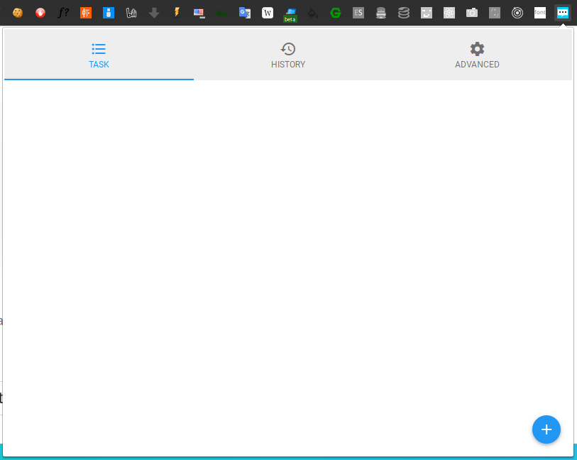
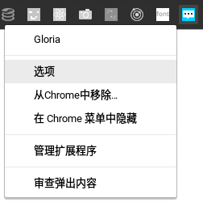
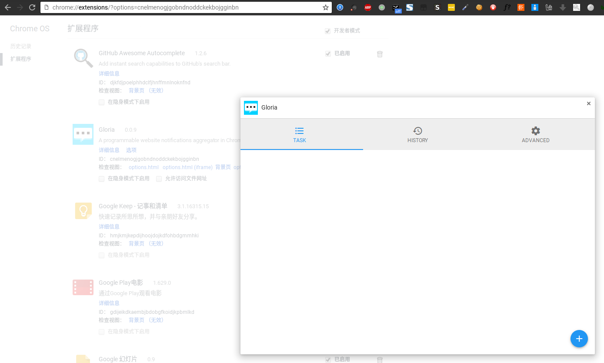
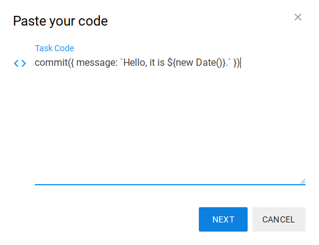
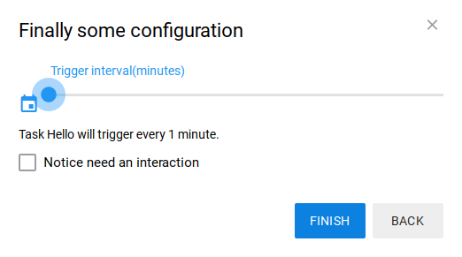
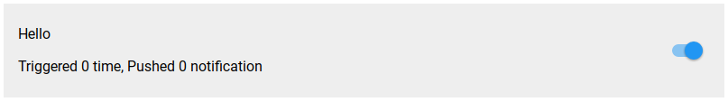
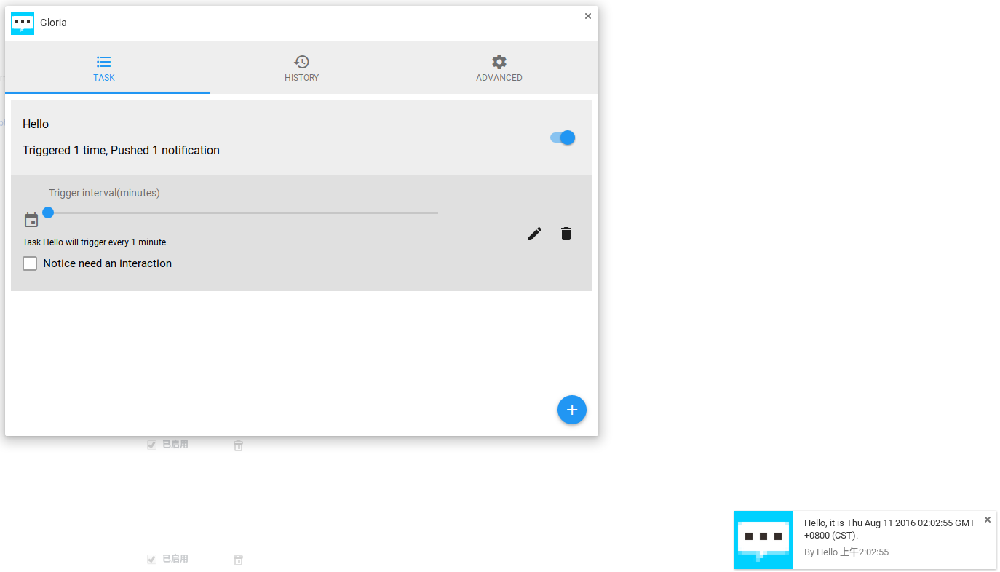
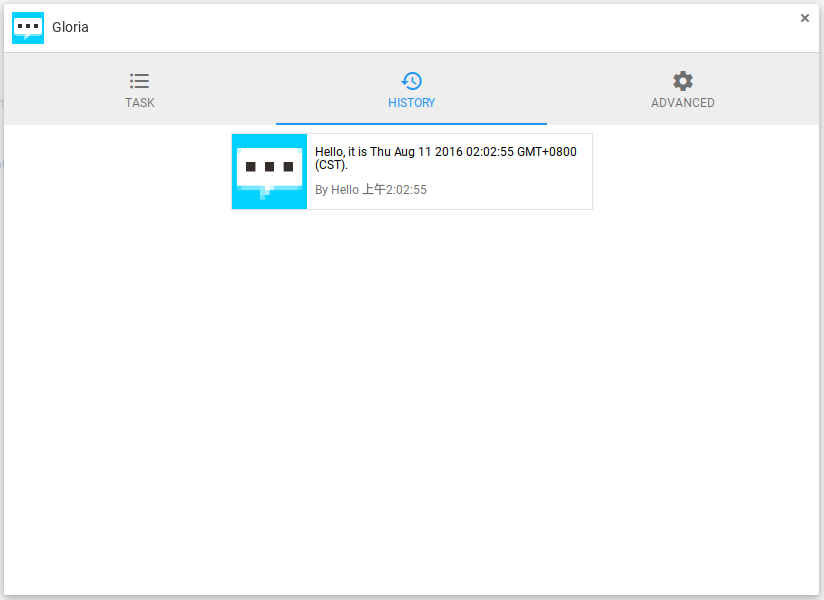
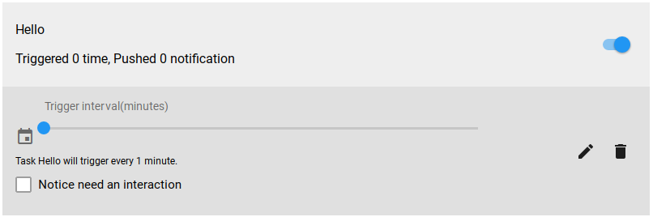

项目停止维护, 详见[issue](https://github.com/BlackGlory/Gloria/issues/41).

# Gloria文档

## 安装Gloria
Gloria是专为Chromium系浏览器开发的, 因此你需要有一个Chromium系的浏览器, 比如Chrome.

### 从Chrome Web Store安装
这是最简单的安装方式, 适用于任何能够访问Chrome Web Store的用户.

<https://chrome.google.com/webstore/detail/gloria/cnelmenogjgobndnoddckekbojgginbn>

### 从源码安装
适用于需要修改扩展项目代码的高级用户.

```sh
git clone https://github.com/BlackGlory/Gloria.git
cd Gloria
yarn install
yanr build
```

## 安装
有关Gloria的一切都是围绕着任务展开的, 每一个任务包含着它所需要执行的代码, 以及其相应的配置信息, 这样Gloria才能知道它应该做些什么.

## 使用指南
### 打开设定界面
#### 弹出窗口中的设定界面
在Chrome浏览器的地址栏右侧, 有着你安装的扩展程序的图标, 找到Gloria的图标并点击它, 设定界面就会弹出.



#### Chrome扩展的标准设定界面打开方式
弹出窗口实际上并不是用来打开Chrome扩展程序设定界面的标准方法, 只不过Gloria将其设成了与设定界面一样的内容.

标准的进入设定界面的方法, 是右键点击地址栏右侧托盘区的Gloria图标, 在弹出的菜单中选择"选项",
此时会打开<chrome://extensions/?options=cnelmenogjgobndnoddckekbojgginbn>页面, 这就是真正的设定界面了.
如果你从扩展程序页面找到Gloria, 并点击"选项", 也将打开同一个设定界面.





### 设定界面
设定界面包含了3个面板, 点击对应的图标即可切换, 它们分别是"任务", "历史记录"和"高级".

#### 任务
"任务"面板是用来存放和展示Gloria当前存储的任务代码的地方, 如果你是首次使用Gloria, 这里会是空的.

#### 历史记录
"历史记录"面板会记录每一个由任务弹出的通知, 如果你忽视了Gloria之前弹出的通知, 你可以在这里找到.
为了节省内存和存储空间, History的通知最大记录数量被限制在50个, 旧的通知将被新的通知替代.

#### 高级
"高级"面板提供与任务开发相关的功能, 大部分用户不需要关心该面板.

### 添加第一个Gloria任务
添加一个Gloria任务非常简单, 切换到"任务"面板, 点击右下角的加号图标.


弹出的对话框会要求你输入此任务的代码, 作为教程, 我们输入以下代码:
```js
commit({ message: `Hello, it is ${new Date()}.` })
```



点击"下一步", 对话框会要求你输入该任务的名称, 我们输入"你好世界", 再点击下一步.



新的对话框看起来有点复杂, 但实际上只有2项内容可以设置：
1. "触发间隔": 通过左右滑动你可以为当前新建的任务设置其触发的间隔时间, 单位是分钟.
   为了更快的看到效果, 请把它调整至1分钟. (注: 从 0.9.8 版本开始, 该滑块被一个输入框替代, 这样你可以更精确的设置间隔时间)
2. "通知需要交互": 勾选此项意味着你当前新建的这个任务弹出的所有通知提醒都不会自动消失, 只有当你与通知产生交互后才会消失, 建议对重要的任务勾选此项.

最后点击"完成", 我们的第一个任务便添加完毕了.



等待1分钟左右, 会有一个有关此任务的通知弹出, 切换到"历史记录"面板也可以找到它.





### 安装来自Gloria.Pub的任务
安装来自Gloria.Pub的任务是非常简单的, 你只需要打开[Gloria.Pub](https://gloria.pub/tasks), 查找你想要安装的任务, 然后点击安装按钮.

来自Gloria.Pub的任务默认的触发间隔是5分钟, 通知不需要交互.

### 修改任务
并不是所有任务都需要实时启动着, 你可以在"任务"面板里找到你想要开启/关闭的任务, 点击右侧的滑块按钮, 决定是否启用此任务.

在"任务"面板点击任务后, 会在下方展开详细设置的面板, 其中包括了你熟悉的"触发间隔"和"通知需要交互"选项, 如果该任务是从Gloria.Pub安装的,
那么还会包含该任务在Gloria.Pub的任务页面, 你可以随时点击进入Gloria.Pub跟进更新和反馈. 位于右侧的是"编辑"和"删除"按钮.



点击"编辑“后会出现与添加任务时类似的对话框, 点击"删除"则会弹出对话框询问你是否真的要删除任务, 确认后任务就会被永久删除.

## 任务开发

### 从最简单的例子开始
有关Gloria的一切都是围绕着任务展开的, 每一个任务包含着它所需要执行的代码, 它们是Gloria最重要的部分, Gloria任务的本质上是一段JavaScript脚本代码.

这是使用指南里出现过的例子, 我们就从解释这段代码开始说起:
```js
commit({ message: `Hello, it is ${new Date()}.` })
```

这段代码首先创建了一个对象:
```
{
  message: `Hello, it is ${new Date()}.`
}
```

这个对象唯一的一个成员变量message, 被初始化为字符串`Hello, it is`加上当前的时间.
创建完对象, 我们将这个对象作为参数调用了commit函数, 一切就结束了, Gloria会定期弹出关于当前时间的通知.

### 状态无关的回调函数: commit
需要说明的是, 我们的任务代码是在一个基于Web Worker技术搭建的沙箱中执行.
这确保了多个任务代码会在不同的线程中独立执行, 各个线程不会互相影响, 同时也保证了Gloria自身的运行环境不会被任务代码污染.

由于Web Worker的特性, 当我们的任务代码想要返回数据给Gloria时, 必须调用回调函数, 而这个回调函数就是commit函数.

commit函数接收一个参数, 这个参数的类型可以是一个Gloria Notification对象, 也可以是一个由Gloria Notification对象组成的数组.
任务代码在执行过程中只能调用一次commit函数, 当该函数被调用, 其所在的Web Worker就会销毁自己,
调用commit就表示当前的任务代码执行完毕, 并将收集到的信息一次性返回给Gloria处理.

调用commit函数会将Gloria Notification返回给Gloria, 但这并不意味着Gloria一定会将返回值以通知的形式呈现给用户.
Gloria的任务代码被刻意设定成状态无关的, 试想你要编写一个获取用户收件箱条目的任务,
你是要每一次返回所有的10个任务(这是该收件箱一次性能够展示内容的极限), 还是每次只返回其中新增的?

从直觉角度考虑, 返回新增的内容是正确的做法, 但在实践中我发现, 很多时候我们无法分辨由网络服务提供的内容新旧与否.
若是在任务代码里包含持久化, 或是管理状态的代码, 则会让代码的复杂度直线上升, 所以Gloria借鉴了函数式编程的思想,
让Gloria的任务代码保持简单——由Gloria决定哪些通知会被显示, 哪些应该被忽略,
这带来的直接影响便是为Gloria编写任务代码的开发者只需要完成用于获取信息的中间件代码, 剩下的一切都会由Gloria自动完成, 开发者无需关心状态.

### 决定是否推送消息的内部状态: stage
Gloria内部决定是否显示一个通知的策略是非常简单的, 所有commit函数传来的Gloria Notification将被缓存进一个叫做stage的地方.
在缓存进stage时, 程序将会对比stage里是否已经存在相似的Gloria Notification对象, 从而决定其是否应该被显示.
当message的内容和之前一样时, Gloria就会认为这个Gloria Notification是已经存在过的旧消息, 不允显示.

当commit的参数处于不同类型时, Gloria的行为会有少许变化, 在Gloria 0.9.9版本以前, 无论传入的是单个Gloria Notification对象,
还是由Gloria Notification组成的数组, 都会被当作"常规任务"处理, 在Gloria 0.9.9及之后的版本里,
新增了一种称作"观察任务"的任务类型, 传入单个Gloria Notification作为参数时会被作为"观察任务"处理.

**注意, 在Gloria 0.9.9及之后的版本里, 一个任务应该明确它的返回值类型, 它要么是返回值为数组的"常规任务", 要么是返回值为单个Gloria Notification的"观察任务", 混合两种返回值会导致未知的结果.**

#### 常规任务
"常规任务"指的是commit参数为数组的任务, 在Gloria 0.9.9以前, 所有任务都会被视为常规任务, 单个Gloria Notification对象会被包装成只有一个对象的数组.

当你新建一个任务, 这个任务在第一次执行时会返回所有它能收集到的内容, 若是这些内容全部都被推送给用户, 将是一个非常恼人的事情.
所以Gloria的常规任务假设你在新建任务时, 之前的所有消息都是你已经读过的, 这样Gloria就只会推送新的消息, 而不会出现首次执行弹出一大堆消息的情况.

这个设计理念的具体实现形式, 便是stage对于第一次commit的结果会全部标记成已读状态, 不允许显示.
当一个任务被创建时, 它的代码会被立刻执行一次, 这就是为什么当你创建任务时, 发现"触发次数"的计数值已经变成了1, 却没有任何通知显示.

值得额外说明的是, 每一个"常规任务"的stage存在一个缓存数量上限, 当stage中缓存的Gloria Notification到达上限时,
它会删除掉旧的Gloria Notification为新的Gloria Notification腾出空间, 所以理论上同一个Gloria Notification是有可能被显示两次的,
请不要刻意造成这种状况.
由于这个上限值有可能在之后的版本里发生改变, 所以开发者不应该关注这个上限的具体值, 只要保证每一次的Gloria Notification不要更新太多新消息就行了,
如果一个消息源的更新频率高到突破了这个上限, 它很可能并不适合用Gloria进行通知.

#### 观察任务
"观察任务"是Gloria 0.9.9版本中加入的新任务类型, 用于解决需要观察目标变化的场景.

当一个任务的commit参数为单个Gloria Notification时, 该任务将被视作"观察任务".
在这种任务类型下, stage将只会记录上一个Gloria Notification, 在有新的Gloria Notification提交时,
会将上一个Gloria Notification与之对比, 决定是否显示新的通知.

#### 关于比较Gloria Notification不同的更多技术细节
你可能需要先阅读"鸭子类型对象: Gloria Notification"一节, 才能理解这些技术细节.

Gloria原先是根据Gloria Notification的`MD5(title + message)`作为参考来判断其是否在stage中重复的.
由于title和message都是在弹出的通知中用户可见的属性, 不便于加入一些用于判定的变量, 所以从Gloria 0.9.0开始,
这个计算方法变成了`MD5(title + message + id)`, 你可以通过在Gloria Notification里加入id变量来避免被当作重复的值.

### 鸭子类型: Gloria Notification
一个Gloria Notification对象或是一个由Gloria Notification构成的数组是commit函数的唯一参数,
它将决定你的通知显示时的形式, 对任务代码而言非常重要.

实际上, Gloria Notification是[Chrome NotificationOptions](https://developer.chrome.com/apps/notifications#type-NotificationOptions)类型的定制版本,
其大多数成员与NotificationOptions是一致的, Gloria Notification放宽了NotificationOptions对于其成员的一些强制要求,
但也有一部分NotificationOptions的成员在Gloria Notification中被禁止使用.

一个标准的Gloria Notification的结构是这样的:
```js
{
  id: String
  title: String
  message: String
  iconUrl: String
  imageUrl: String
  url: String
}
```

该对象的每一个成员都是可选的, 它们的默认值如下:
```js
{
  id: '',
  title: '',
  message: '',
  iconUrl: 'assets/images/icon-128.png', // Gloria Icon
  imageUrl: undefined,
  url: undefined
}
```

你返回的值只需要包含其中的一部分, Gloria会将你返回的对象和这个初始对象合并, 最后得出一个符合NotificationOptions标准的对象.
Gloria Notification的成员将怎样决定通知的显示效果, 让我们来看一个实例:


它的Gloria Notification对象是这样的:
```js
{
  title: "王老菊带你石油大亨02：大股东！",
  message: "市长同志跟我讲话, 说「都决定啦, 你来当大股东」, 我说另请高明吧. 我实在我也不是谦虚, 我一个挖石油的煤老板, 怎么到市里来了呢?但是呢, 市长同志讲「大家已经研究决定了」, 所以, 我就被坑了一万多块钱, 当下了这个股东. ",
  iconUrl: "http://i1.hdslb.com/bfs/face/b55e96895608e03c3435d018b708a705ccc2bda4.gif",
  imageUrl: "http://i0.hdslb.com/bfs/archive/6a41f5a2d59513b513f944d876c83089fc3d9cf1.jpg_320x200.jpg",
  url: "http://www.bilibili.com/video/av5750678/"
}
```

title, message会决定标题和信息的文字内容, 要注意的是, Chrome通知里的message的字号比title要小一号,
当message显示不下时, 还会以省略号的形式结尾.

iconUrl会决定通知左上角的图标, 这是Chrome强制规定的, 如果你的Gloria Notification不包含 iconUrl, 则会被显示成Gloria自己的图标.

imageUrl会决定通知下方的大尺寸图片, 很多消息源里是找不到这样的图片的, 如果不包含imageUrl, 显示图片的那一块区域会被取消.
如果你使用过Chrome的NotificationOptions, 会知道显示带有图片的通知必须要修改通知的type参数为 "image",
我认为这相当多余, 所以在 Gloria 里, Gloria Notification 是鸭子类型的,
如果包含imageUrl, type将被自动修改成"image", 这些事情你都不需要在Gloria里操心.

url将决定点击这个通知后打开什么页面, 如果不包含 url, 通知也仅仅是变成点击不会打开页面而已.
从Gloria 0.9.0版本开始, 如果通知的url已经在Chrome里打开, 则会直接转到已经打开的标签页, 而不是创建一个新的标签页.

*从Gloria 0.9.0开始, 你可以通过给Gloria Notification添加id属性来标志一个Gloria Notification的唯一性, id属性会和title、message一样用于去重计算, 详见"stage- 更多技术细节"一节.*

另外, Gloria会自动设置NotificationOptions的contextMessage值为发出该通知的任务名称和推送时间的信息.

由于Chrome的限制, 如果你的title内容过长, 则会变成两行, 使得message彻底消失:


当title的值为空字符串时, Chrome Notification会去掉标题, 这样message就可以显示多行, 由于message的字号会略小于title,
所以能够显示更多文字, 对于文本量较多的消息, 开发者应该只使用message进行显示.

#### 带有Cookie的内置fetch函数

在创建网络请求这件事上, Gloria用fetch取代了XMLHttpRequest, Chrome内置了fetch函数, 你可以在[MDN](https://developer.mozilla.org/zh-CN/docs/Web/API/Fetch_API)找到fetch的使用方法.

Gloria任务代码运行环境下的fetch与原本的fetch稍有不同, 所有通过fetch创建的请求, 都会自动加上目标url的Cookie, 这样就能利用当前Chrome在目标网站上的登录状态, 轻松的获取到你想要的数据, 使得那些略显私人的通知提醒也成为了可能.
在Gloria运行环境下的XMLHttpRequest并没有被加上这个特性, 所以如果你不想要自带Cookie, 用XMLHttpRequest就可以了, 我认为这个需求是相当小的.

这是一个用fetch获取当前登录bilibili的用户的订阅内容的任务代码, 代码非常简单:
```js
fetch('http://api.bilibili.com/x/feed/pull?ps=10&type=0&pn=1')
.then(res => res.json())
.then(json => {
  let notifications = json.data.feeds.map(feed => {
    return {
      title: feed.addition.title
    , message: feed.addition.description
    , iconUrl: feed.source.avatar
    , imageUrl: feed.addition.pic
    , url: feed.addition.link
    }
  })
  commit(notifications)
})
```

#### 异步载入外部脚本: importScripts
熟悉Web Worker的开发者可能知道, Web Worker的运行环境内置了一个importScripts函数用于同步载入外部脚本, 这意味着很强的扩展性, 但由于Web Worker的运行环境里是没有window这个global对象的, 很多外部脚本并不是针对这样的环境编写的, 于是强大的能力无从发挥, 有着强大的库却无法使用, 着实是一件令人难受的事情.

出于兼容性和主动缓存方面的考虑, 这个函数在Gloria的任务代码运行环境里被改造成了异步的, 而且会制造一个虚拟的window对象, 以便一些外部脚本可以正常执行.
调用这个异步的importScripts会返回一个Promise对象, `Promise.then`的回调函数所接收到的第一个参数就是载入的外部脚本的返回值.

建议开发者使用webpack打包自己需要的外部脚本, 在使用webpack的情况下, 你甚至可以使用一些本来为Node.js环境编写的模块,
比如 [cheeriojs/cheerio](https://github.com/cheeriojs/cheerio).
由于Web Worker里没有DOM, 所以当需要分析一个HTML网页时, 会很需要一个像cheerio这样的模块.

从仓库clone代码, 用`npm install`安装依赖, 再用webpack打包代码:
```sh
webpack --target=web --entry=./index.js --output-filename=./cheerio-bundle.js --module-bind=json
```

生成的`cheerio-bundle.js`就是那个可以直接用在importScripts上的外部脚本, 接着你可以像这样使用它:
```js
Promise.all([
  importScripts('http://cdn.blackglory.me/cheerio-bundle.js')
, fetch('https://www.zhihu.com/noti7/stack/vote_thank?limit=10').then(res => res.json())
])
.then(([cheerio, { msg }]) => {
  let $ = cheerio.load(msg)
    , notifications = []
  $('.zm-noti7-content-item').each((i, el) => {
    let notification = {
      iconUrl: 'https://pic1.zhimg.com/2e33f063f1bd9221df967219167b5de0_m.jpg'
    , message: $(el).text().trim().replace(/\n/g, '')
    , url: ((base, href) => {
        if (!href.startsWith('http')) {
          if (href.startsWith('/')) {
            return `${base}${href}`
          } else {
            return `${base}/${href}`
          }
        }
        return href
      })('http://www.zhihu.com', $(el).find('a.question_link, a.post-link').attr('href'))
    }
    notifications.push(notification)
  })
  commit(notifications)
})
```

importScripts会主动缓存你加载的外部脚本, 在第一次执行之后, 你的代码就可以以本地访问的速度载入该外部脚本.

*注意: Gloria的importScripts只支持单个参数, 与 Web Worker 的调用方式有所不同, 此处是我的设计失误, 日后可能会在新版本的 Gloria 代码里对其进行修改, 新版本将独立于旧版本代码, 所以不会产生兼容性问题, 请放心使用 importScripts 函数.*

Gloria 内置了一些常用的模块, 你可以通过`importScripts('gloria-utils')`加载这些内部模块, 并通过ES6的解构赋值特性, 从中方便的提取你想要的模块.

这是 gloria-utils 包含的依赖项版本:
```json
{
  "cheerio": "^1.0.0-rc.2",
  "cookie": "^0.3.1",
  "immutable": "^3.8.2",
  "lodash": "^4.17.10",
  "moment": "^2.22.2",
  "qs": "^6.5.2",
  "ramda": "^0.25.0",
  "rx": "^4.1.0",
  "sanitize-html": "^1.18.2",
  "systemjs": "^0.21.4",
  "underscore.string": "^3.3.4",
  "validator": "^10.3.0",
  "xml2js": "^0.4.19",
  "xregexp": "^4.2.0"
}
```

#### 运行时长
在0.13.0版本中增加了对任务代码运行时长的限制, 单个Gloria任务的执行时间最多为1分钟, 超时执行会被强制中断.

#### 调试任务
Gloria在"高级"面板提供了一些方便开发者调试的功能, 你可以在这里测试你的任务代码, 测试代码的执行结果不会经过stage, 所以一旦有notification被 commit, 你可以直接看到通知效果.
如果你的任务代码有同步的错误(比如语法错误), 错误将会显示, 但Gloria的任务代码大多数是异步代码, 如果你的异步代码产生了错误, 那么只能在扩展程序的"背景页"看到错误输出.

1. 进入Chrome的扩展管理界面: <chrome://extensions/?id=cnelmenogjgobndnoddckekbojgginbn>
2. 点击检查视图(inspect views)下的背景页面(background page), 从而打开Gloria的后台DevTools.
3. 通过点击地址栏旁边的Gloria图标, 或在Chrome扩展管理界面打开Gloria设置界面.
4. 切换到"高级"面板, 将你的代码粘贴到"测试任务代码"的文本框里, 点击测试.

代码里的输出和网络请求都会在后台DevTools里显示, 测试任务提交的通知对象和简单的错误信息则会在"测试任务代码"下方显示.

### 常见问题
#### fetch 解码非 UTF-8 编码的页面
使用 [TextDecoder](https://developer.mozilla.org/en-US/docs/Web/API/TextDecoder).

例子: 解码 gbk 编码的页面
```js
fetch('...')
.then(res => res.arrayBuffer())
.then(buf => new TextDecoder('gbk').decode(buf))
.then(html => {
  ...
})
```

#### Gloria Notification 的 URL 可以支持回调函数吗?
在可以预见的将来还不能支持, 原因在于支持回调函数免不了要在扩展的运行环境里执行自定义的代码, 将有可能污染到扩展的运行环境.

### 通知 Reducer
出于增强Gloria扩展性的考虑, Gloria 0.9.0加入了通知Reducer功能, 你可以在高级面板找到它.

通知Reducer是一个同步的JavaScript函数, 每一个预备弹出的Gloria Notification对象都会被当作参数传入Reducer函数一次.

你可以用Reducer过滤你不想弹出的Notification, 或是做一些修改, 也可以在这时候将Notification通过HTTP请求发送给其他服务.

Reducer接收一个Gloria Notification作为参数, 并返回一个新的Gloria Notification, 该返回值将被用于弹出通知.
如果Reducer没有返回值, 或是返回null, 则视为将该Gloria Notification抛弃.

出于性能和易用性的考虑, Reducer函数的运行级别非常高, 它被设定为直接在Gloria代码的运行环境里执行,
所以任何错误的代码都将有可能破坏当前Gloria的运行时环境, 使用时请务必多加小心.

#### 示例
##### 过滤 Notification
```js
function reducer(notification) {
  if (notification.message.includes('something')) {
    return null
  }
  return notification
}
```

##### 修改 Notification
```js
function reducer(notification) {
  if (notification.message.includes('IP')) {
    notification.message.replace(/IP/g, 'intellectual property')
  }
  return notification
}
```

##### 支持Pushbullet
你可以通过Pushbullet将Gloria的通知同步到移动设备上.

```js
function reducer(notification) {
  const data = {
    type: 'note'
  , title: notification.title
  , body: notification.message
  }

  if (notification.url) {
    data.type = 'link'
    data.url = notification.url
  }

  fetch('https://api.pushbullet.com/v2/pushes', {
    method: 'POST'
  , headers: new Headers({
      'Access-Token': 'YOUR_ACCESS_TOKEN'
    , 'Content-Type': 'application/json'
    })
  , body: JSON.stringify(data)
  })

  return notification
}
```

请手动替换代码中的`YOUR_ACCESS_TOKEN`为你自己的.
